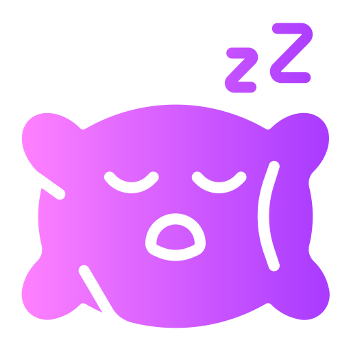
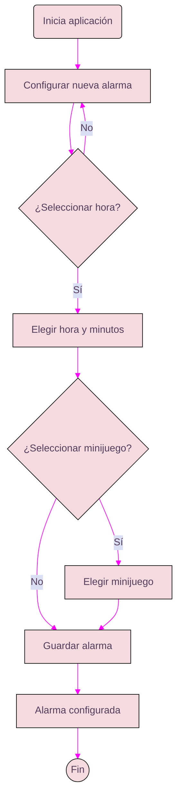
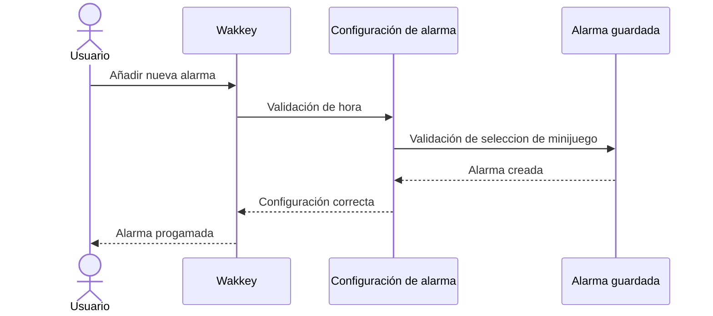
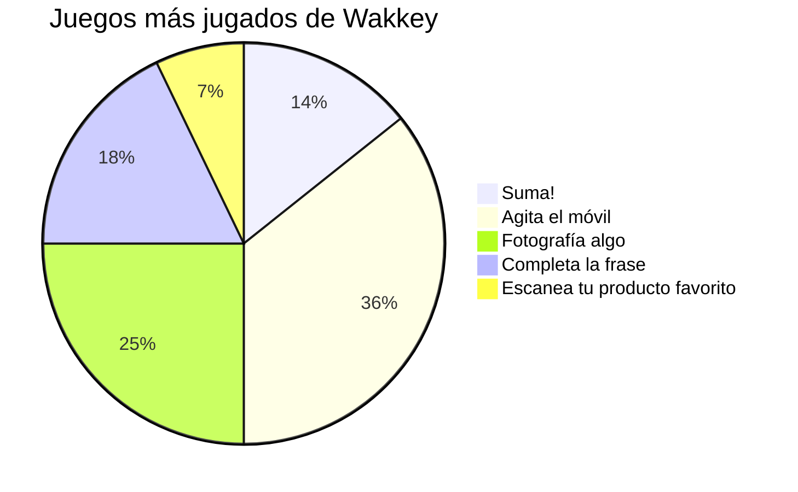
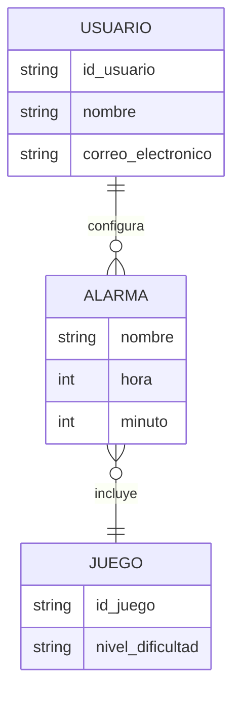
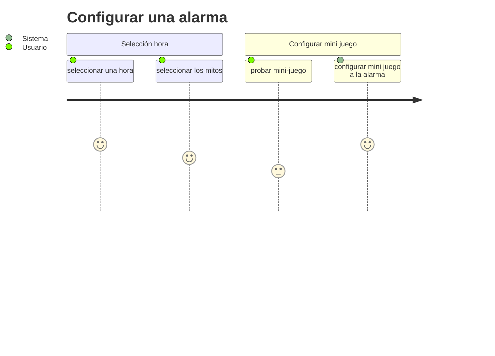
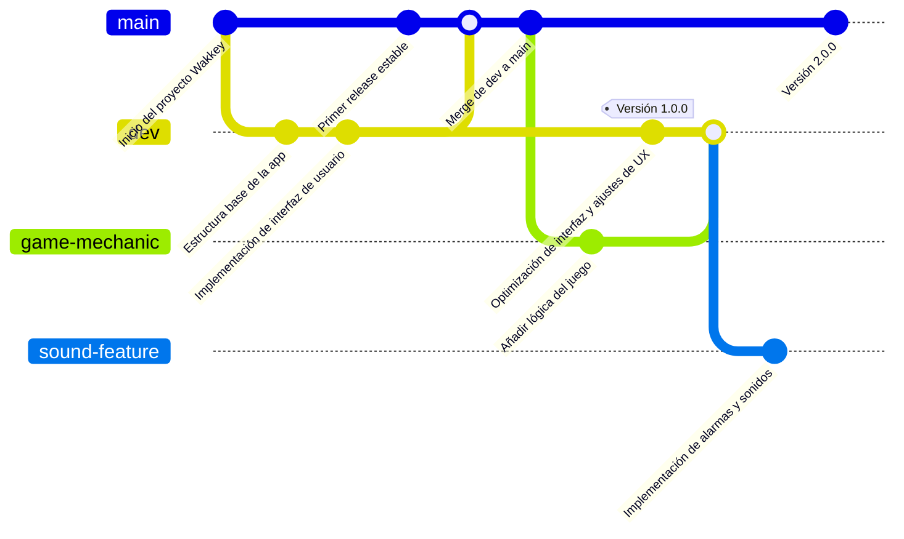
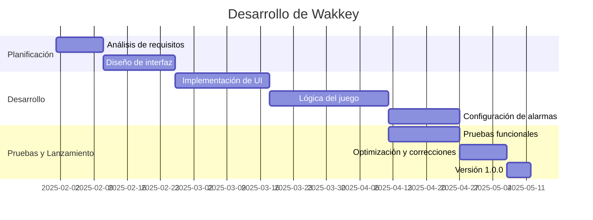
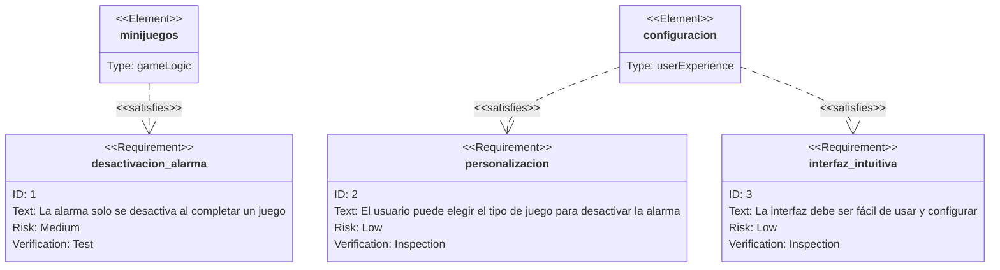

# <center><u> Proyecto Final DAMV 2º</center></u>

## Wakkey ⏰


## Table of Contents 📄
1. [Información General](#información-general-ℹ️)
2. [Cracterísticas](#características-✨)
3. [Tecnologías](#tecnologías-🖥️)
4. [Instalación](#instalación-🔧)
5. [Uso](#uso-📱)
6. [Preguntas Frecuentes](#preguntas-frecuentes-❓)


## <span style="color:blue;">1. Información General ℹ️</span>
Wakkey es una aplicación móvil pensada para personas a la que les cuesta despertarse con una simple alarma. 
Debes completar el mini-juego que te aparecerá en pantalla para descativar la alarma, ¡si no lo consigues seguirá sonando!
Wakkey incluye cronómetro y un temporizador.
Configura tu alarma y al despertar completa el mini-juego que más te llame la atención.
<center>¡Descárgalo ya!</center>
<br>
> "El sueño es un arte poético involuntario." 
Friedrich Nietzsche 

## 2. Cracterísticas ✨

✅ *Configura múltiples alarmas con sonidos personalizados.*

✅ *Mini juegos para desactivar la alarma.* 

✅ *Interfaz intuitiva y fácil de usar.*

✅ *Modo oscuro y claro.*


| Nombre   | Descripción                                | Estado  |
|----------|------------------------------------------|---------|
| Wakkey   | Aplicación de alarma con juego          | En desarrollo |
| Plataforma | Android                              | Planeado |
| Método de apagado | Resolver un juego o desafío   | Implementado |
| Notificaciones | Recordatorios y alertas           | Pendiente |
| Personalización | Sonidos y niveles de dificultad  | En progreso |


### <u>Ejemplos de juegos 🎮</u>

[Ejemplo de juego](https://www.youtube.com/watch?v=9hOJH7IflFo&pp=ygUqYW5kcm9pZCBzdHVkaW8ga290bGluIGNyZWFjaW9uIGRlIHVuIGp1ZWdv "Tic Tac Toe")
[](https://www.youtube.com/watch?v=LBRrW08_P8c&list=PLhcYacorV7U6HHVsfXnWodwEPI0E38BXD&ab_channel=DinoCode-Tutoriales)


## 3. Tecnologías 🖥️
Las tecnologías usadas para este programa han sido:
- **Kotlin**: Lenguaje principal de la aplicación.
- **SQLite**: Almacenamiento de datos y configuraciones, ya que esta aplicación no requiere un almacenamiento de gran volumen.
 
## 4. Instalación 🔧
Para instalar la aplicación, sigue estos pasos:
1. Clona el repositorio: ```git clone https://github.com/Leczzz/Wakkey.git```

2. Abre el proyecto en Android Studio.
3. Compila y ejecuta la aplicación en un emulador o dispositivo físico.

## 5. Uso 📱
1. Abre la aplicación.
2. Configura tu alarma junto con el mini-juego que quieras completar una vez llegue a sonar.
3. Al sonar la alarma, completa el mini-juego para desactivarla.
4. Utiliza el cronómetro y el temporizador según tus necesidades.

## 6. Preguntas Frecuentes ❓
***¿Cómo configuro una alarma?***

- Abre la aplicación, selecciona la opción de configurar alarma, elige la hora y el mini-juego a completar y guarda la configuración.

***¿Qué pasa si no completo el mini-juego?***
- La alarma seguirá sonando hasta que completes el mini-juego.

***¿Puedo usar mi propia música como alarma?***
- Actualmente, esta funcionalidad no está disponible, pero estamos trabajando en ello para futuras versiones, pero puedes escoger alguna de nuestra librería.

***¿Puedo establecer varias alarmas a la vez?***
- Sí, no supondría ningún problema. 

***¿Hay niveles de dificultad en los minijuegos?***
- No, pero entre los mini-juegos ya establecidos si que hay diferencia de dificultad. Existen mini-juegos más fáciles y más complejos.
 
 ***¿Qué pasa si no logro completar el minijuego?***
 - En caso de completarse el juego en un periodo de 5 minutos, se apagrá automáticamente. 

 ***¿Puedo desactivar la opción de minijuegos y apagar la alarma manualmente?***
 - ¡Sí! No obligamos a configurar un mini-juego a tu alarma, pero si te lo recomendamos. 

 ***¿Cual es el correo para contactar en caso de incidencias?***
 - Contáctianos mediante <wakkey@atencionalcliente.com>. 

___
## Diagrama de Flujo Flowchar



___
## Diagrama de Secuencia


___
## Gráfico circular

___
## Diagrama Entidad-Relación

___
## Diagramas Journey

___
## Diagrama Git

___
## Diagramas Gantt

___
## Diagramas de Requerimientos



